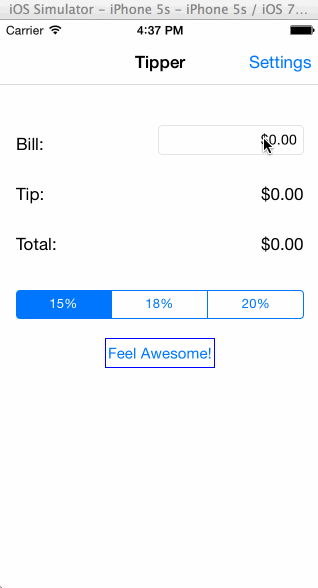

Tipper
======

A Tip Calculator. Calculate the tip. The default rates are 15%, 18%, 20%. The total amount can be rounded up, rounded down or no rounding. Display the amount divided by 2, 3, and 4 people.

Time spent: 12 hours spent in total

Completed user stories:
 * [x] Required: Creating the Tip Calculator.
 * [x] Required: Adding Tip Calculator Settings Page.
 * [x] Optional: Remember the bill amount across app restarts. After an extended period of time, clear the state.
 * [x] Optional: Use locale specific currency and currency thousands separators.

Additional user stories:
 * [x] Additional: Round the amount. Set rounding mode. User can set no rounding, rounding up, and rounding down in Settings page.
 * [x] Additional: Add a "Feel Awesome" Button. By clicking that, it will randomly generate a tip rate between 20% and 30%.
 * [x] Additional: Add a new new to show the amount divided by 2, 3, and 4 people. It will disappear when user enters and appear when user finishes entering.
 
Walkthrough of all user stories:

 
GIF created with [LiceCap](http://www.cockos.com/licecap/).

## Acknowledge

This app leverages two third-party libraries:

 * [Nick Hodapp](https://github.com/TomSwift) for the [TSCurrencyTextField](https://github.com/TomSwift/TSCurrencyTextField).

 * FaceBook [POP](https://github.com/facebook/pop).
